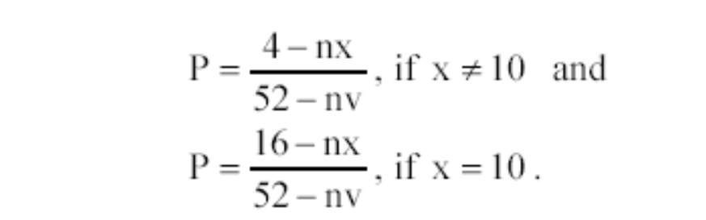
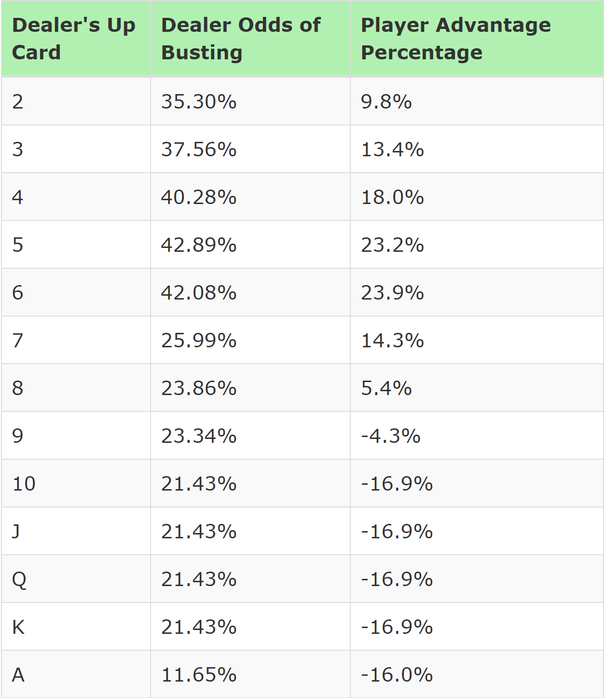
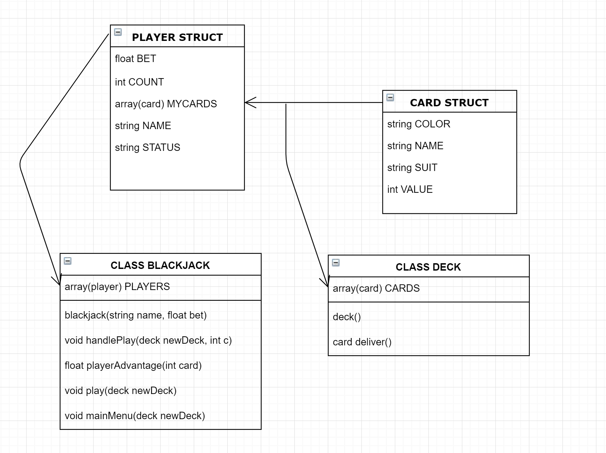

#BLACKJACK PROJECT#
        <!DOCTYPE html>
<html>
    <head>
        <title>BLACKJACK</title>
        <meta charset="UTF-8">
        <meta name="viewport" content="width=device-width, initial-scale=1.0">
    </head>
    <body>
  
   <h1>BLACKJACK PROJECT</h1>
        <h2><strong>Team name:</strong> BlackJack.  <strong>Members:</strong> Omar Lopez Vie.</h2>
          This project simulates the blackjack game. It also integrates the player’s probabilities of advantage against the dealer's hand and the probabilities of the player getting the needed value to add up to 21 as his next card.

    
 To calculate the probability for the next card to be the needed value for the player to add up to 21 is based on the following formula:
  
    

<strong> nx = desired card value. nv = number of cards showing.</strong>

    
 To calculate the probability of advantage that the player has against the dealers showing cards is calculated by the following table:

     

    <h2>Program objectives?</h2><h3>Explain how your program is interacting with the user and its purpose.</h3> 
The objective of this program is to simulate the game of blackjack and integrating probability concepts to the game. The program interacts with the user by asking the user to choose different options throughout the game. Probabilities are shown beforehand, so the user can consider them for her/his next decision.

    <h2>How are discrete structures implemented in the C++ program?</h2>
<strong>Probability</strong> is used to calculate the potential next play outcome. The probabilities of getting the needed value to score 21 on the next card is calculated by subtracting the number of cards with the desired value that are showing (player’s and dealer’s) to the number of suits in a single deck (4), and dividing it by the difference between the number of cards in a deck (52) and the number of cards that are showing its value.

    <h2>Limitations of the program? Provide recommendation on improving the limitations of the program.</h2>
    <ol>
        <li>The program is only designed for only one player (user). </li>
        <li>The program is designed to only contained one deck of cards.</li>
        <li>The program does not allow the dealer to continue asking for more cards, once the user stands. Thus, the dealer automatically stands as well.</li>
        <li>The desired next card gives a negative number, once the user count exceeds 21.  </li>
    </ol>
    <h2>Pseudocode</h2>
    <table>
        <tr><td> 1. Ask for the user name.</td></tr>
        <tr><td> 2. Ask for the bet amount.</td></tr>
        <tr><td> 3. Introduce the options to continue or to quit. </td></tr>
        <tr><td> 4. If the user opts to continue, the program generates a new deck, using the class deck, and the struct player and the struct card.</td></tr>
        <tr><td> 5. Then, the program assigns two cards to each player’s cards array as their initial hand.</td></tr>
        <tr><td> 6. Ask the user if he or she desires to continue or quit.</td></tr>
        <tr><td> 7. If the user opts to continue, show action menu.</tr>
        <tr><td> 8. If the user opts to ask for another card, assign a card to the user and dealer respectively.</td></tr>
        <tr><td> 9. Check if one of the parties has exceeded 21.</tr>
        <tr><td>10. If the user has not exceeded 21, ask the user if he wants to ask for another card.</td></tr>
        <tr><td>11. If one of the parties has exceeded 21, show results.</td></tr>
    </table>
     

</body>
<footer>
    

Posted by: Omar Lopez Vie .

</footer>
</html>
